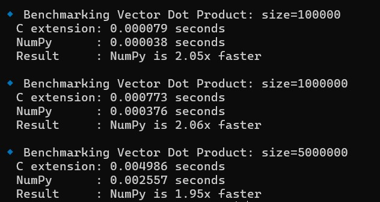
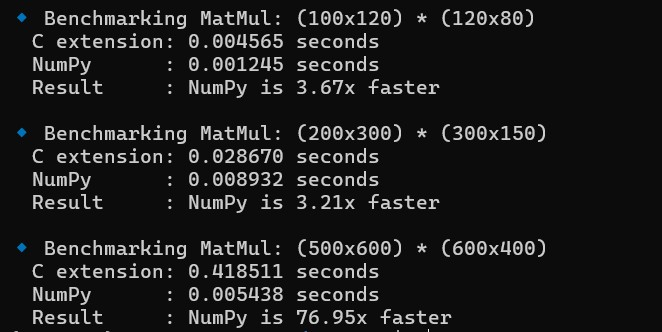

# Mini-ML: High-Performance Vector & Matrix Library in C for Python

Mini-ML is a lightweight **C backend library** integrated with Python for **fast vector and matrix operations**, designed as a foundation for building machine learning algorithms. It leverages **low-level C optimizations** and Python wrappers to give you **performance comparable to NumPy** while remaining easy to use.

---

## 🔹 Features

### Core Data Structures
- **Vector**
  - Creation, deletion, printing
  - Basic operations: add, subtract, scalar multiply/divide
  - Dot product (optimized with loop unrolling and SIMD-ready)
  - Magnitude (Euclidean norm)
- **Matrix**
  - Creation, deletion, printing
  - Basic operations: add, subtract, scalar multiply/divide
  - Transpose
  - Matrix multiplication (naive and optimized)
  - Compatible with Python lists

### Python Integration
- Full Python wrappers for all vectors and matrices
- Returns Python-accessible **capsules** for memory-safe operations
- Easy to call from Python ML code

### Optimizations
- **Loop unrolling** for dot product
- **SIMD-ready structure** for future AVX/SSE optimization
- Minimal memory overhead, contiguous allocations
- Benchmarkable against NumPy for performance comparison

---
### Benchmarking

### Vector Dot Product


### Matrix Multiplication


## 🔹 Installation

```bash
git clone https://github.com/yourusername/mini-ml.git
python3 setup.py build_ext --inplace
